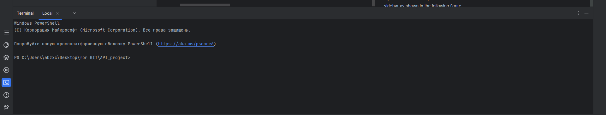
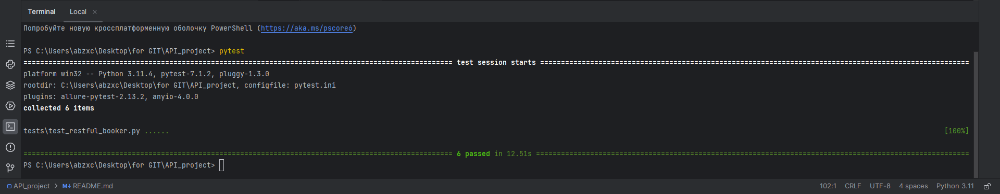

<h1 align="center">RESTFUL BOOKER API TESTING PROJECT</h1>  
<p align="center">
    
</p>
<p align="center">This is hAPI cat. That's it!</p>

<h2 align="center">Used stack</h2>
<p align="center">
    <a href="https://www.python.org/">
        
    </a>
    <a href="https://www.jetbrains.com/pycharm/">
        
    </a>
    <a href="https://restfulapi.net/http-methods/">
        
    </a>
    <a href="https://docs.pytest.org/">
        
    </a>
    <a href="https://git-scm.com/">
        
    </a>
    <a href="https://www.jenkins.io/">
        
    </a>
    <a href="https://allurereport.org/">
        
    </a>
    <a href="https://qameta.io/">
        
    </a>
    <a href="https://telegram.org/">
        
    </a>
</p>  

<h2 align="center">Content</h2>  

* [Description](#description)  
* [Tests launch](#tests-launch)  
    * [Local launch](#local-launch)  
        * [Preparing the environment](#preparing-the-environment)  
        * [Launch](#launch)  
        * [Generating a test report](#generating-a-test-report)  
    * [Launch using Jenkins](#launch-using-jenkins)  
* [Tests results](#tests-results)  
    * [TestOps report](#testops-report)  
    * [Allure report](#allure-report)  
    * [Telegram notification](#telegram-notification)  

## Description

Tests are developed using [Python](https://www.python.org/) programming language, [Requests](https://pypi.org/project/requests/) library and [PyTest](https://docs.pytest.org/) framework. Reports are generated by [Allure Report](https://allurereport.org/). Test reports are also sent by [Telegram Bot](https://core.telegram.org/bots) if you launch tests [using Jenkins](#launch-using-jenkins).  
In this project we test [Restful-booker](https://restful-booker.herokuapp.com/apidoc/) ```GET```, ```PUT```, ```POST``` and ```DELETE``` REST API HTTP methods.  

## Tests launch

### Local launch

#### Preparing the environment

Before launch, you need to install the following (installation guide links are provided):  
* [PyCharm](https://www.jetbrains.com/pycharm/).  
* [Requests](https://pypi.org/project/requests/).  
* [PyTest](https://docs.pytest.org/en/7.4.x/getting-started.html#install-pytest).  
* [Allure Pytest](https://pypi.org/project/allure-pytest/).  

Also, download the repository with this project on your PC/laptop:  
* Click on "**<> Code**" on the [project page](https://github.com/engovadzip/restful_booker_API_project).  
* In the opened pop-up menu click on "**Download ZIP**".  
* Download it to preferred directory and unpack downloaded archive there.  

Create ```.env``` file in the directory. Open it. Insert the following lines:
```
BASE_URL="https://restful-booker.herokuapp.com/"  
FIRSTNAME=""  
LASTNAME=""  
TOTALPRICE=""  
DEPOSITPAID=""  
CHECKIN=""  
CHECKOUT=""  
ADDITIONALNEEDS=""  
USER=""  
PASSWORD=""  
```

Fill ```FIRSTNAME```, ```LASTNAME```, ```TOTALPRICE```, ```DEPOSITPAID```, ```CHECKIN```, ```LASTNAME```, ```CHECKOUT```, ```ADDITIONALNEEDS``` in quotes as described [here](https://restful-booker.herokuapp.com/apidoc/index.html#api-Booking-CreateBooking) in **Request body** title.  
Fill ```USER``` with username and ```PASSWORD``` with password in quotes as described [here](https://restful-booker.herokuapp.com/apidoc/index.html#api-Auth-CreateToken) in **Request body** title.  

#### Launch

Open any downloaded project's file in PyCharm (right click on file -> Edit with PyCharm). There will be the following window:  
<p align="center">
    
</p>

Click on **Open in Project**. After that there will be a following window:  
<p align="center">
    
</p>

Click on **Trust Project**.  
Open a terminal in the opened PyCharm window by clicking on terminal button. The button locates at the bottom of the left sidebar as shown in the following figure:
<p align="center">
    
</p>
The terminal will open in the bottom of PyCharm as shown in the following figure:
<p align="center">
    
</p>

Launch tests using the following command:  
```
pytest
```
There will be tests result line in terminal when tests will finish. Its example:  
<p align="center">
    
</p>

#### Generating a test report

Tests report is generated by Allure Report. To check it, run the following command after tests:  
```
allure serve allure-results
```  
After that, your system's default browser will open and there will be a [generated report](#allure-report).  

### Launch using Jenkins

Open this project on [Jenkins](https://jenkins.autotests.cloud/job/engovadzip_API_project/). The project's page example is provided below.
<p align="center">
      
</p>  

Click on "**Build Now**".  

<p align="center">
      
</p>  

There will be a new build below "**Build History**" title as shown in the following figure:  
<p align="center">
      
</p>  

Build's status will change when tests will finish. And there will appear [TestOps](#testops-report) and [Allure](#allure-report) reports as shown in the following figure:  
<p align="center">
      
</p>

## Tests results

### TestOps report
Go to [Jenkins project's page](https://jenkins.autotests.cloud/job/engovadzip_API_project/). Click on  in one of successful builds. Tests report is provided below:
<p align="center">
      
</p>  

<p align="center">
      
</p>  

### Allure report

If you generate report locally, follow the [instruction](#generating-a-test-report). If you generate it on Jenkins, click on  in one of successful builds. Tests report from Jenkins is provided below:
<p align="center">
      
</p>  

There will not be **TREND** in the report if you generate report locally. It will be in Jenkins only. 

### Telegram notification

After Jenkins' build will finish, Telegram Bot will send a notification with test results to Telegram chat. The chat is private. It is only for tests developer and responsible members. The notification is provided below:
<p align="center">
      
</p>  